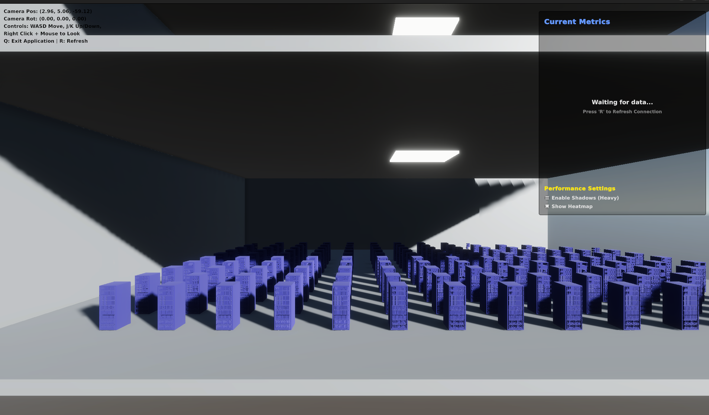
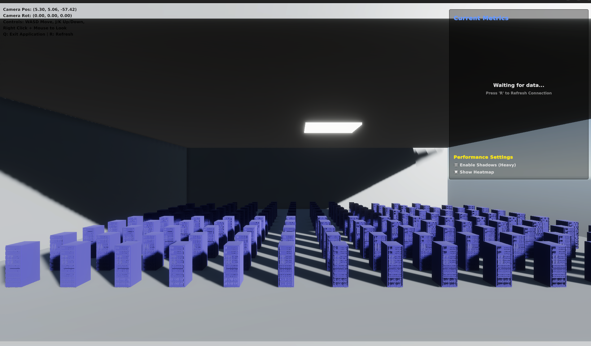

# Data Center Digital Twin Simulation


This Unity project simulates a **high-fidelity Data Center Digital Twin**, featuring procedural room generation, interactive server racks, live data visualization via heatmaps, and external connectivity through WebSockets. It is designed to visualize real-time data center operations in an immersive 3D environment.

---

## Screenshots

| Simulation View | Data Visualization |
|:---:|:---:|
|  |  |

---

## Table of Contents

- [Features](#features)
- [Getting Started](#getting-started)
- [Controls](#controls)
- [Architecture](#architecture)
- [Contributing](#contributing)
- [License](#license)

---

## Features

- **Procedural Environment**: Automatically generates a server room layout with customizable parameters using `RoomGenerator`.
- **Free Camera Navigation**: Fly through the scene with standard WASD controls, featuring adjustable movement speed and mouse sensitivity.
- **Interactive Racks**: Click on server racks to view detailed information with visual feedback on selection.
- **Heatmap Visualization**: Toggleable heatmap overlay to visualize temperature or power data across the data center, managed by `HeatmapManager`.
- **Live Data Integration**: Connects to an external data source (e.g., Python backend) via `WebSocketConnector` to update simulation status in real-time.
- **UI Dashboard**: Displays simulation metrics and controls via `SimulationUI`, providing a central hub for interaction.

---

## Getting Started

### Prerequisites

- **Unity**: Version **6000.2.10f1** (Unity 6) or later.
- **Backend (Optional)**: A WebSocket data source if you wish to use the live data features.

### Installation

1.  **Clone the Repository**:
    ```bash
    git clone https://github.com/adityavvyas/DCDT-simulation.git
    ```

2.  **Open in Unity**:
    - Launch **Unity Hub**.
    - Click **Add** and select the cloned `DCDT-simulation` folder.
    - Open the project (this may take a few minutes to import assets).

3.  **Run the Simulation**:
    - Navigate to the `Assets/Scenes` folder in the Project window.
    - Double-click the main scene file to open it.
    - Press the **Play** button at the top of the editor.

---

## Controls

### Camera Movement

| Key | Action |
| :--- | :--- |
| **W** / **A** / **S** / **D** | Move Forward / Left / Backward / Right |
| **J** / **K** | Move Up / Down |
| **Shift** (Hold) | Move Faster (Sprint) |
| **Right Click** (Hold) | Look around (Mouse look) |

### Simulation Controls

| Key | Action |
| :--- | :--- |
| **Q** | Exit Application (or Stop Play Mode) |
| **F** | Toggle Fullscreen |
| **R** | Refresh WebSocket Connection |

---

## Architecture

This project is built with modularity in mind:

- **`Assets/Scripts`**: Contains the core C# logic.
    - **RoomGenerator**: Handles procedural generation of the floor, walls, and rack placement.
    - **HeatmapManager**: Manages the shader-based heatmap visualization.
    - **WebSocketConnector**: Handles network communication with external data providers.
    - **SimulationUI**: Manages the on-screen user interface.
- **`Assets/Prefabs`**: Stores reusable game objects like Server Racks, UI widgets, and environmental props.
- **`ProjectSettings`**: Contains all Unity project-specific configurations.

---

## Contributing

Contributions are welcome! Please follow these steps:

1.  Fork the project.
2.  Create your feature branch (`git checkout -b feature/AmazingFeature`).
3.  Commit your changes (`git commit -m 'Add some AmazingFeature'`).
4.  Push to the branch (`git push origin feature/AmazingFeature`).
5.  Open a Pull Request.

---

## License

This project is licensed under the **GNU General Public License v3.0**. See the [LICENSE](LICENSE) file for details.
